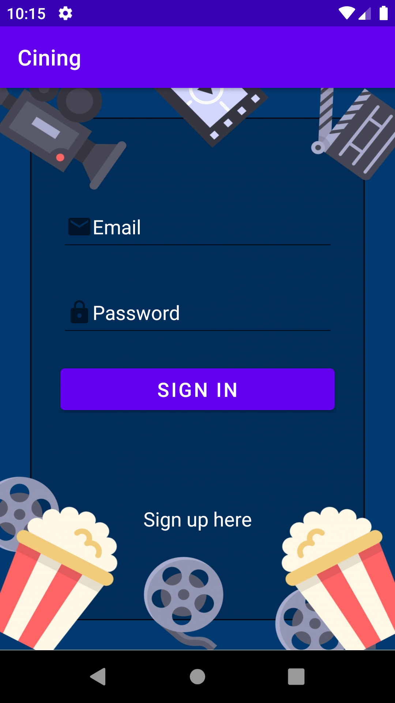
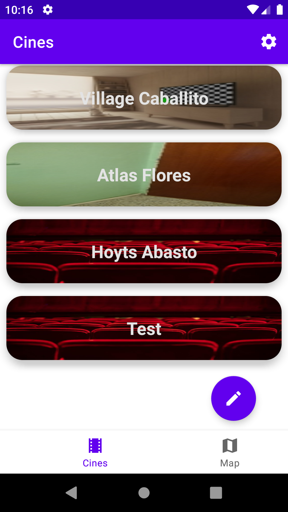
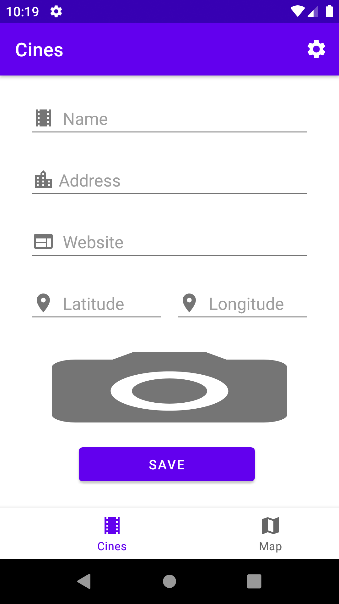
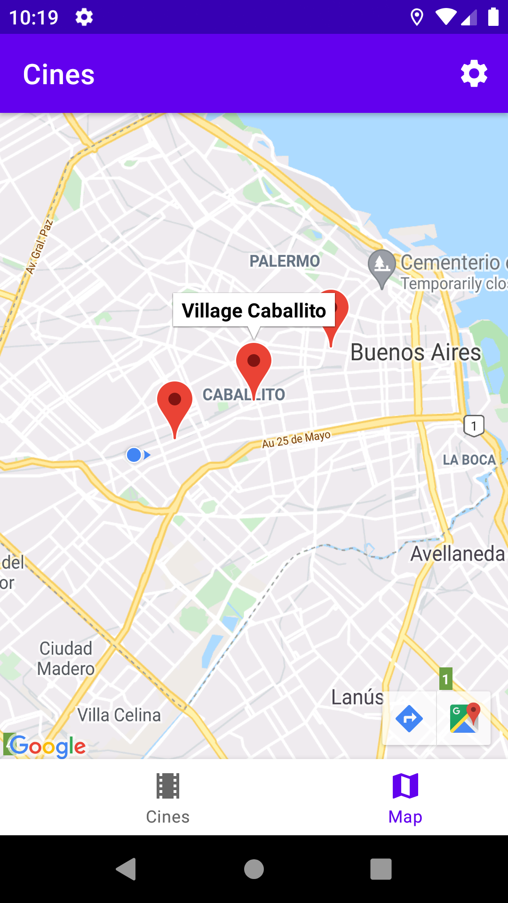
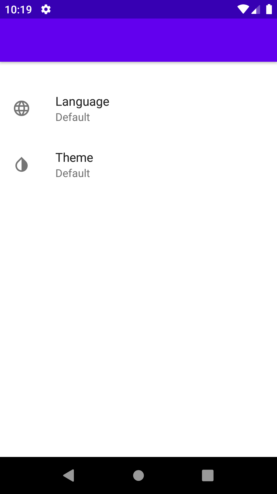

# Cining

## Simple Kotlin App - Academic
It consists on a CRUD for places. On this case Cines (aka Cinemas)
Registered users can create a place and GEOLocate it.
This app also contains a registration module integrated with Google authorization.
The places contains a title, address, website, geolocation and a photo.
The app also allows the user to change some settings such as the language (english/spanish) and the theme.

This app implements:
- Firestore
- Google Authentication with email/password
- Google Storage
- GeoLocation
- Google maps

#### Local database
The room branch provides the same CRUD and user registration using a local database.
It implements SQLite with Room.

## Run it
1. Create a Firebase account on Google [[link]](https://console.firebase.google.com)
2. Activate Firestore, Authentication and Storage on Firebase
3. Add the google-services.json file to the project
4. Activate Google maps SDK for Android
5. Add the google_maps_api-xml file with the secret key to app/main/res/values/
6. Build & Run the app

## Screenshots

| Login | List |
| :---: | :---: |
|  |  |
| Create | Map |
|  |  |
| Settings|  |
|  |  |

